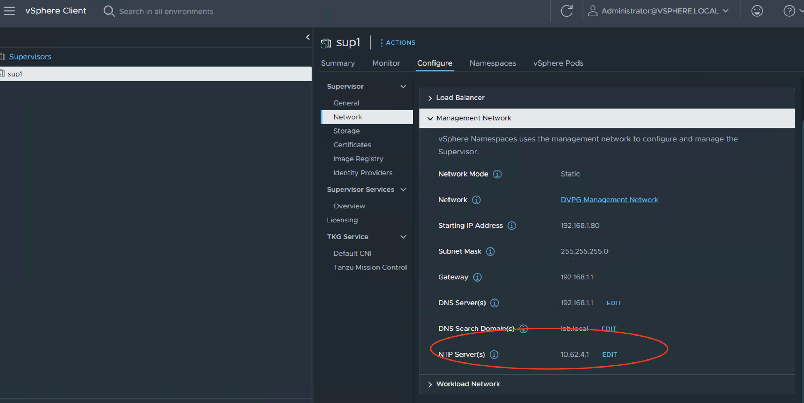
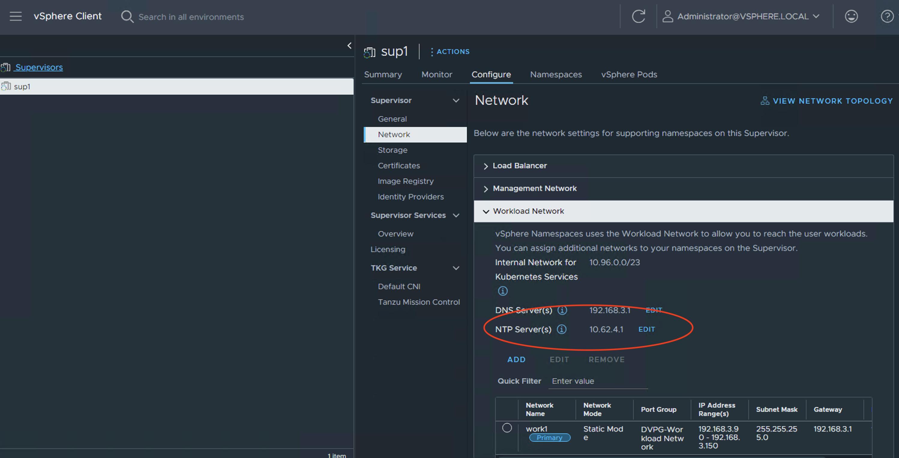
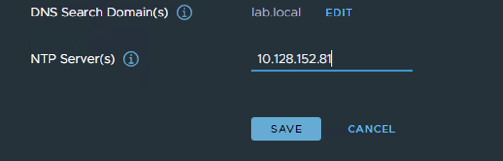
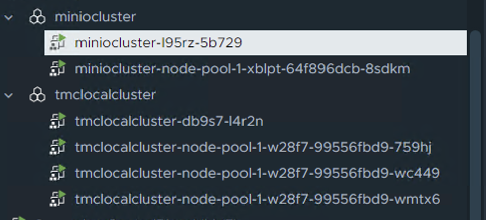
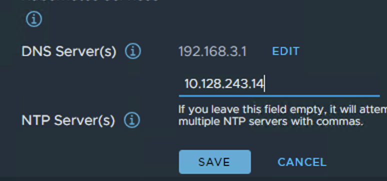
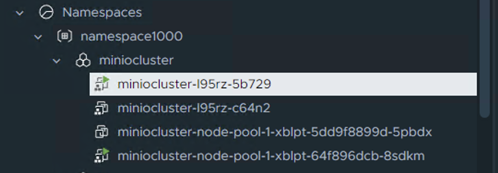
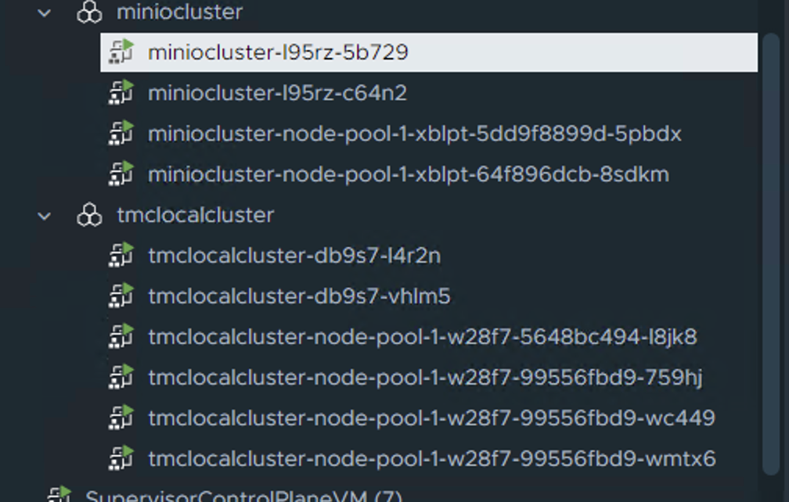

# NTP in Tanzu and how the IP settings can propergate when a change is needed

In vCenter there are 2 places with in the supervisor cluster to hchange the NTP settings for the kubernetes clusters (supervisor/guest clusters) 

They are in the supervisor section under management and workload networks. 





# The question is what happens when the management NTP IP is changed? 

Loggin onto the super visor node we see the current IP is 10.62.4.1

```
timedatectl show-timesync
LinkNTPServers=10.62.4.1
FallbackNTPServers=0.vmware.pool.ntp.org 1.vmware.pool.ntp.org 2.vmware.pool.ntp.org 3.vmware.pool.ntp.org
ServerName=10.62.4.1
ServerAddress=10.62.4.1
```

Now I am changing the IP in the vCenter GUI. 




After about ~45seconds the change is propagated to the supervisor nodes.

```
timedatectl show-timesync
LinkNTPServers=10.128.152.81
FallbackNTPServers=0.vmware.pool.ntp.org 1.vmware.pool.ntp.org 2.vmware.pool.ntp.org 3.vmware.pool.ntp.org
ServerName=10.128.152.81
ServerAddress=10.128.152.81
```

# The next question is what happens when the workload NTP IP is changed?
# What happens to the workload clusters (* here cluster was not created with NTP settings in the yaml file! more on that further down) 

I have currenly 2 clusters ( I am on the supervisor controll plane): 




```
root@4223a1b0a09ff5f75249d31b10f724a1 [ ~ ]# k get clusters -A
NAMESPACE       NAME              PHASE         AGE   VERSION
namespace1000   miniocluster      Provisioned   21h   v1.23.8+vmware.2
namespace1000   tmclocalcluster   Provisioned   77d   v1.24.9+vmware.1
```

Looking at the nodes: 

```
root@4223a1b0a09ff5f75249d31b10f724a1 [ ~ ]# kubectl get virtualmachines -A
NAMESPACE       NAME                                                POWER-STATE   AGE
namespace1000   miniocluster-l95rz-5b729                            poweredOn     21h
namespace1000   miniocluster-node-pool-1-xblpt-64f896dcb-8sdkm      poweredOn     21h
namespace1000   tmclocalcluster-db9s7-l4r2n                         poweredOn     21h
namespace1000   tmclocalcluster-node-pool-1-w28f7-99556fbd9-759hj   poweredOn     21h
namespace1000   tmclocalcluster-node-pool-1-w28f7-99556fbd9-wc449   poweredOn     21h
namespace1000   tmclocalcluster-node-pool-1-w28f7-99556fbd9-wmtx6   poweredOn     21h
```
Getting IP of a Node: 

```
root@4223a1b0a09ff5f75249d31b10f724a1 [ ~ ]# kubectl  -n namespace1000 get virtualmachine  miniocluster-node-pool-1-xblpt-64f896dcb-8sdkm  -o jso
npath='{.status.vmIp}'
192.168.3.105
```

Generating ssh key and jumping onto the guestcluster node: 

```
kubectl get  secret -n namespace1000  miniocluster-ssh -o jsonpath='{.data.ssh-privatekey}' | base64 -d > test-cluster-ssh-key
chmod 600 test-cluster-ssh-key
ssh -i test-cluster-ssh-key vmware-system-user@192.168.3.105
```
Lets find the current NTP setting: 

```
vmware-system-user@miniocluster-node-pool-1-xblpt-64f896dcb-8sdkm [ /etc ]$ cat /etc/chrony.conf | grep server
# Use public servers from the pool.ntp.org project.
# servers
server 10.62.4.1 iburst
```
Changing the NTP IP on the workload network: 



After 3-4 minutes the first guest cluster gets re-paved.  
Notice it does the control plane and the worker node at the same time (have lots of IP address in the pool open!) 




When the fisrt cluster is done re-paving the second cluster gets re-paved with the new NTP information

The second cluster is being worked on now as well

```
root@4223a1b0a09ff5f75249d31b10f724a1 [ /etc ]# kubectl get virtualmachines -A
NAMESPACE       NAME                                                POWER-STATE   AGE
namespace1000   miniocluster-l95rz-5b729                            poweredOn     22h
namespace1000   miniocluster-l95rz-c64n2                            poweredOn     9m7s
namespace1000   miniocluster-node-pool-1-xblpt-5dd9f8899d-5pbdx     poweredOn     9m10s
namespace1000   miniocluster-node-pool-1-xblpt-64f896dcb-8sdkm      poweredOn     22h
namespace1000   tmclocalcluster-db9s7-l4r2n                         poweredOn     22h
namespace1000   tmclocalcluster-db9s7-vhlm5                         poweredOn     9m8s
namespace1000   tmclocalcluster-node-pool-1-w28f7-5648bc494-l8jk8   poweredOn     9m10s
namespace1000   tmclocalcluster-node-pool-1-w28f7-99556fbd9-759hj   poweredOn     21h
namespace1000   tmclocalcluster-node-pool-1-w28f7-99556fbd9-wc449   poweredOn     21h
namespace1000   tmclocalcluster-node-pool-1-w28f7-99556fbd9-wmtx6   poweredOn     22h
```



After a while this will normalize 

Jumping onto the guestcluster again and checking the NTP IP:

```
vmware-system-user@miniocluster-node-pool-1-xblpt-5dd9f8899d-5pbdx [ ~ ]$ cat /etc/chrony.conf | grep server
# Use public servers from the pool.ntp.org project.
# servers
server 10.128.243.14 iburst
```
It is changed!
Outcome so far the workload network NTP change triggered all clusters created with out a NTP setting to be re-paved. 

# The next question is what happens when the workload NTP IP is changed and there is a NTP setting in the cluster create yaml file?

I am deleting my minio cluster and creating it with a granular NTP setting in the YAML file 

```
kubectl vsphere login --server 192.168.2.100 --vsphere-username administrator@vsphere.local  --insecure-skip-tls-verify
k config use-context namespace1000
k delete -f ./miniocluster_no_ntp.yaml  
k apply -f ./miniocluster.yaml
```

THe yaml file looks like this:

```
---
apiVersion: cluster.x-k8s.io/v1beta1
kind: Cluster
metadata:
  name: miniocluster
  namespace: namespace1000
spec:
  clusterNetwork:
    services:
      cidrBlocks: ["10.96.0.0/12"]
    pods:
      cidrBlocks: ["192.167.0.0/16"]
    serviceDomain: "cluster.local"
  topology:
    class: tanzukubernetescluster
    version: v1.23.8---vmware.2-tkg.2-zshippable
    controlPlane:
      replicas: 1
    variables:
      - name: vmClass
        value: best-effort-xsmall 
    workers:
      machineDeployments:
        - class: node-pool
          name: node-pool-1
          replicas: 1
    variables:
      - name:  ntp
        value: "time.google.com"
      - name: vmClass
        value: best-effort-xsmall 
      - name: storageClass
        value: pacific-gold-storage-policy
      - name: defaultStorageClass
        value: pacific-gold-storage-policy
      - name: nodePoolVolumes
        value:
        - capacity:
            storage: "10Gi"
          mountPath: "/data"
          name: localvolume
          storageClass: pacific-gold-storage-policy
      - name: controlPlaneVolumes
        value:
        - capacity:
            storage: "4Gi"
          mountPath: "/var/lib/etcd"
          name: etcd
          storageClass: pacific-gold-storage-policy
```

Notice the NTP section and I am looking at google for time. 


