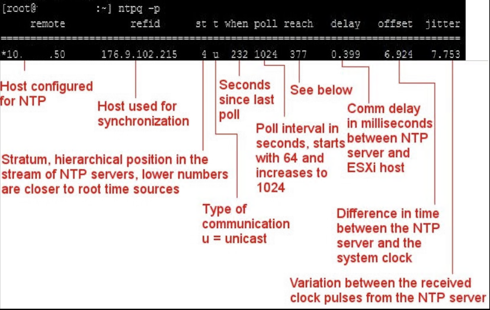
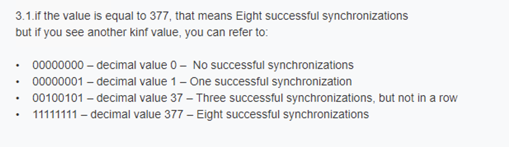
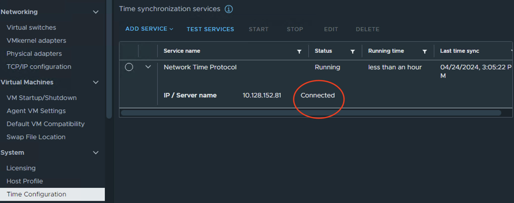
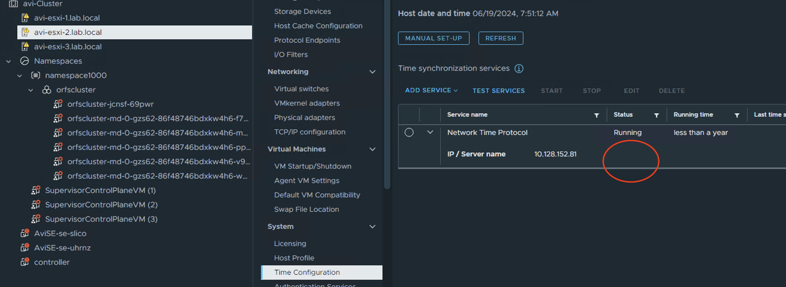
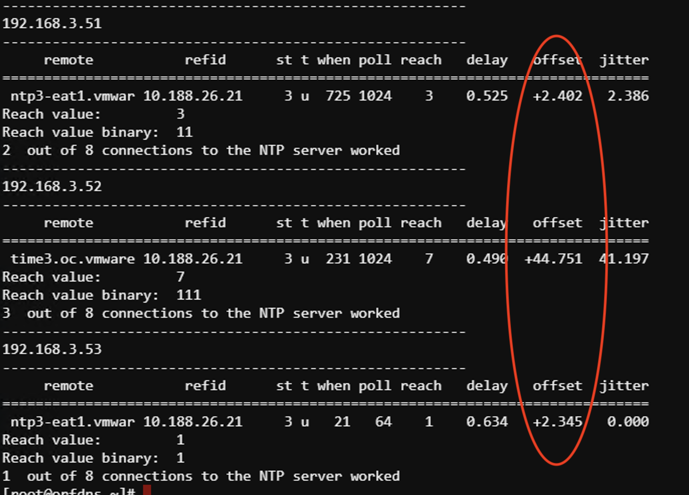
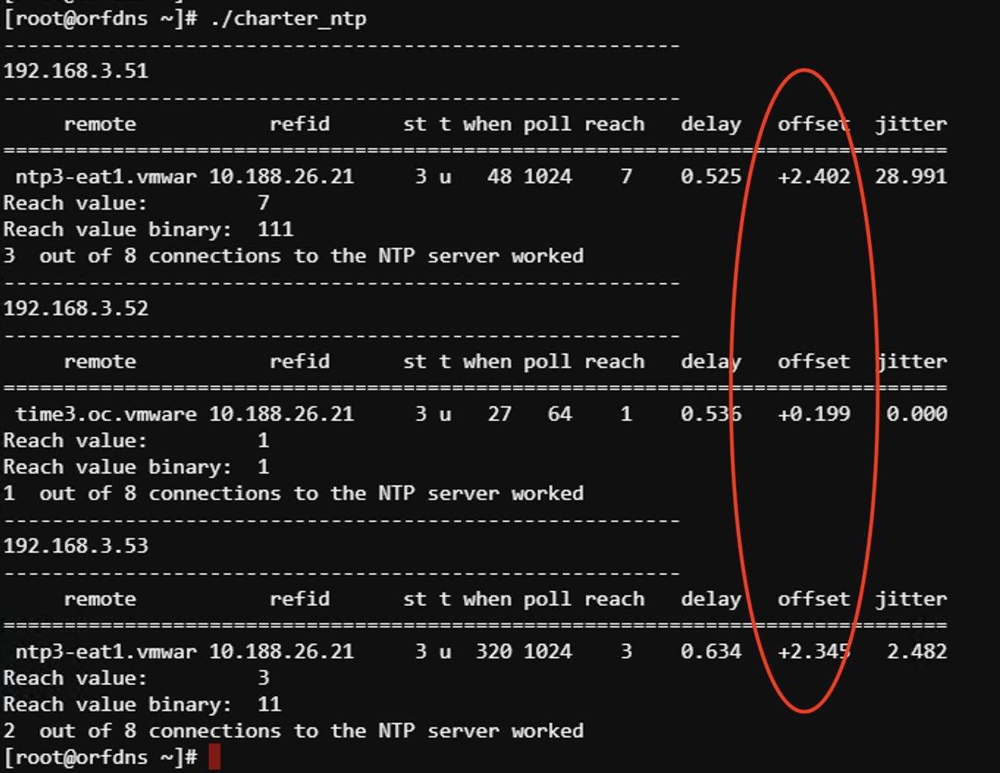

# NTP in Tanzu and how the IP settings can propergate when a change is needed (vCenter 8u2/apiVersion: cluster.x-k8s.io/v1beta1)

In vCenter there are 2 places with in the supervisor cluster to hchange the NTP settings for the kubernetes clusters (supervisor/guest clusters) 

They are in the supervisor section under management and workload networks. 


# The question is what happens when the management NTP IP is changed? 

Loggin onto the super visor node we see the current IP is 10.62.4.1

```
timedatectl show-timesync
LinkNTPServers=10.62.4.1
FallbackNTPServers=0.vmware.pool.ntp.org 1.vmware.pool.ntp.org 2.vmware.pool.ntp.org 3.vmware.pool.ntp.org
ServerName=10.62.4.1
ServerAddress=10.62.4.1
```

Now I am changing the IP in the vCenter GUI. 


After about ~45seconds the change is propagated to the supervisor nodes.

```
timedatectl show-timesync
LinkNTPServers=10.128.152.81
FallbackNTPServers=0.vmware.pool.ntp.org 1.vmware.pool.ntp.org 2.vmware.pool.ntp.org 3.vmware.pool.ntp.org
ServerName=10.128.152.81
ServerAddress=10.128.152.81
```

# The next question is what happens when the workload NTP IP is changed?
# What happens to the workload clusters (* here cluster was not created with NTP settings in the yaml file! more on that further down) 

I have currenly 2 clusters ( I am on the supervisor controll plane): 


```
root@4223a1b0a09ff5f75249d31b10f724a1 [ ~ ]# k get clusters -A
NAMESPACE       NAME              PHASE         AGE   VERSION
namespace1000   miniocluster      Provisioned   21h   v1.23.8+vmware.2
namespace1000   tmclocalcluster   Provisioned   77d   v1.24.9+vmware.1
```

Looking at the nodes: 

```
root@4223a1b0a09ff5f75249d31b10f724a1 [ ~ ]# kubectl get virtualmachines -A
NAMESPACE       NAME                                                POWER-STATE   AGE
namespace1000   miniocluster-l95rz-5b729                            poweredOn     21h
namespace1000   miniocluster-node-pool-1-xblpt-64f896dcb-8sdkm      poweredOn     21h
namespace1000   tmclocalcluster-db9s7-l4r2n                         poweredOn     21h
namespace1000   tmclocalcluster-node-pool-1-w28f7-99556fbd9-759hj   poweredOn     21h
namespace1000   tmclocalcluster-node-pool-1-w28f7-99556fbd9-wc449   poweredOn     21h
namespace1000   tmclocalcluster-node-pool-1-w28f7-99556fbd9-wmtx6   poweredOn     21h
```
Getting IP of a Node: 

```
root@4223a1b0a09ff5f75249d31b10f724a1 [ ~ ]# kubectl  -n namespace1000 get virtualmachine  miniocluster-node-pool-1-xblpt-64f896dcb-8sdkm  -o jso
npath='{.status.vmIp}'
192.168.3.105
```

Generating ssh key and jumping onto the guestcluster node: 

```
kubectl get  secret -n namespace1000  miniocluster-ssh -o jsonpath='{.data.ssh-privatekey}' | base64 -d > test-cluster-ssh-key
chmod 600 test-cluster-ssh-key
ssh -i test-cluster-ssh-key vmware-system-user@192.168.3.105
```
Lets find the current NTP setting: 

```
vmware-system-user@miniocluster-node-pool-1-xblpt-64f896dcb-8sdkm [ /etc ]$ cat /etc/chrony.conf | grep server
# Use public servers from the pool.ntp.org project.
# servers
server 10.62.4.1 iburst
```
Changing the NTP IP on the workload network: 


After 3-4 minutes the first guest cluster gets re-paved.  
Notice it does the control plane and the worker node at the same time (have lots of IP address in the pool open!) 


When the fisrt cluster is done re-paving the second cluster gets re-paved with the new NTP information

The second cluster is being worked on now as well

```
root@4223a1b0a09ff5f75249d31b10f724a1 [ /etc ]# kubectl get virtualmachines -A
NAMESPACE       NAME                                                POWER-STATE   AGE
namespace1000   miniocluster-l95rz-5b729                            poweredOn     22h
namespace1000   miniocluster-l95rz-c64n2                            poweredOn     9m7s
namespace1000   miniocluster-node-pool-1-xblpt-5dd9f8899d-5pbdx     poweredOn     9m10s
namespace1000   miniocluster-node-pool-1-xblpt-64f896dcb-8sdkm      poweredOn     22h
namespace1000   tmclocalcluster-db9s7-l4r2n                         poweredOn     22h
namespace1000   tmclocalcluster-db9s7-vhlm5                         poweredOn     9m8s
namespace1000   tmclocalcluster-node-pool-1-w28f7-5648bc494-l8jk8   poweredOn     9m10s
namespace1000   tmclocalcluster-node-pool-1-w28f7-99556fbd9-759hj   poweredOn     21h
namespace1000   tmclocalcluster-node-pool-1-w28f7-99556fbd9-wc449   poweredOn     21h
namespace1000   tmclocalcluster-node-pool-1-w28f7-99556fbd9-wmtx6   poweredOn     22h
```


After a while this will normalize 

Jumping onto the guestcluster again and checking the NTP IP:

```
vmware-system-user@miniocluster-node-pool-1-xblpt-5dd9f8899d-5pbdx [ ~ ]$ cat /etc/chrony.conf | grep server
# Use public servers from the pool.ntp.org project.
# servers
server 10.128.243.14 iburst
```
It is changed!
Outcome so far the workload network NTP change triggered all clusters created with out a NTP setting to be re-paved. 

# The next question is what happens when the workload NTP IP is changed and there is a NTP setting in the cluster create yaml file?

I am deleting my minio cluster and creating it with a granular NTP setting in the YAML file 

```
kubectl vsphere login --server 192.168.2.100 --vsphere-username administrator@vsphere.local  --insecure-skip-tls-verify
k config use-context namespace1000
k delete -f ./miniocluster_no_ntp.yaml  
k apply -f ./miniocluster.yaml
```

The yaml file has a section for the worker like this:

```
---
    workers:
      machineDeployments:
        - class: node-pool
          name: node-pool-1
          replicas: 1
          variables:
            overrides:
            - name:  ntp
              value: "0.pool.ntp.org"
```

Notice the NTP section and I am looking at ntp.org for time. 

The ntp override has been applied to the workers (right now only the workers can be changed from the default) 

```
k describe cluster miniocluster       | grep ntp -w2
        Name:           localvolume
        Storage Class:  pacific-gold-storage-policy
      Name:             ntp
      Value:            10.128.243.14
      Name:             storageClass
--
        Variables:
          Overrides:
            Name:   ntp
            Value:  0.pool.ntp.org

```


# NTP investigation on ESXi servers

```
#!/bin/bash
#
# ntp investigtion
# yum install sshp
# https://www.cloudhba.com/NTP-troubleshooting-on-ESXi-host/
#
declare -a list=("192.168.3.51" "192.168.3.52" "192.168.3.53")
line='--------------------------------------------------------'
#
for host in "${list[@]}"
do 
  echo $line
  echo $host
  echo $line
  sshpass -p 'mypassword' ssh root@$host "ntpq -p" >  /tmp/a.txt
  cat /tmp/a.txt
  export cnt=`cat /tmp/a.txt | tail -1  | awk '{print $7}'`
  export cnt1=`echo "obase=2; $cnt" | bc `
  export cnt2=`echo "obase=2; $cnt" | bc |  awk -F1 '{print NF-1}'`
  echo "Reach value:        " $cnt
  echo "Reach value binary: " $cnt1
  echo $cnt2 " out of 8 connections to the NTP server worked"
done
rm /tmp/a.txt
```

Outcome: 

```
--------------------------------------------------------
192.168.3.51
--------------------------------------------------------
     remote           refid      st t when poll reach   delay   offset  jitter
==============================================================================
 time3.oc.vmware 10.66.37.81      3 u  264 1024    3    0.476   +2.498   2.331
Reach value:         3
Reach value binary:  11
2  out of 8 connections to the NTP server worked
--------------------------------------------------------
192.168.3.52
--------------------------------------------------------
     remote           refid      st t when poll reach   delay   offset  jitter
==============================================================================
*time3.oc.vmware 10.66.37.81      3 u   43  128  377    0.545  +53.967  21.963
Reach value:         377
Reach value binary:  101111001
6  out of 8 connections to the NTP server worked
--------------------------------------------------------
192.168.3.53
--------------------------------------------------------
     remote           refid      st t when poll reach   delay   offset  jitter
==============================================================================
*ntp3-eat1.vmwar 10.66.37.81      3 u  598 1024   77    0.667  +163.33 120.686
Reach value:         77
Reach value binary:  1001101
4  out of 8 connections to the NTP server worked
```

# NTP investigation on a workload cluster

```
#!/bin/bash
#
# ntp worker node investigtion
# https://www.cloudhba.com/NTP-troubleshooting-on-ESXi-host/
#
# commands to get key and IP list
#
# kubectl vsphere login --server 192.168.3.80 --vsphere-username administrator@vsphere.local --tanzu-kubernetes-cluster-namespace namespace1000 --tanzu-kubernetes-cluster-name orfscluster --insecure-skip-tls-verify
# kubectl config use-context namespace1000
# kubectl get clusters
# kubectl get virtualmachines -o wide
#get IPs
#kubectl get virtualmachines -o wide | tail -n +2 | awk '{ print $5 }'
#
#export NAMESPACE=namespace1000
#get cluster
#export cl=`kubectl get clusters | tail -n +2 | awk '{ print $1 }'`
#
#kubectl -n $NAMESPACE get secret $cl-ssh -o jsonpath='{.data.ssh-privatekey}' | base64 -d > test-cluster-ssh-key
#chmod 600 test-cluster-ssh-key
#
declare -a list=(
192.168.7.103
192.168.7.110
192.168.7.104
192.168.7.107
192.168.7.111
192.168.7.105
)
line='--------------------------------------------------------'
#
for host in "${list[@]}"
do 
  echo $line
  echo $host
  echo $line
  ssh -i test-cluster-ssh-key vmware-system-user@$host "timedatectl"  &
done
```

Outcome: 
```
--------------------------------------------------------
192.168.7.103
--------------------------------------------------------
--------------------------------------------------------
192.168.7.110
--------------------------------------------------------
--------------------------------------------------------
192.168.7.104
--------------------------------------------------------
--------------------------------------------------------
192.168.7.107
--------------------------------------------------------
--------------------------------------------------------
192.168.7.111
--------------------------------------------------------
--------------------------------------------------------
192.168.7.105
--------------------------------------------------------
               Local time: Wed 2024-06-19 15:59:34 UTC
           Universal time: Wed 2024-06-19 15:59:34 UTC
                 RTC time: Wed 2024-06-19 15:59:34
                Time zone: UTC (UTC, +0000)
System clock synchronized: yes
              NTP service: active
          RTC in local TZ: no
               Local time: Wed 2024-06-19 15:59:34 UTC
           Universal time: Wed 2024-06-19 15:59:34 UTC
                 RTC time: Wed 2024-06-19 15:59:34
                Time zone: UTC (UTC, +0000)
System clock synchronized: yes
              NTP service: active
          RTC in local TZ: no
               Local time: Wed 2024-06-19 15:59:34 UTC
           Universal time: Wed 2024-06-19 15:59:34 UTC
                 RTC time: Wed 2024-06-19 15:59:34
                Time zone: UTC (UTC, +0000)
System clock synchronized: yes
              NTP service: active
          RTC in local TZ: no
               Local time: Wed 2024-06-19 15:59:34 UTC
           Universal time: Wed 2024-06-19 15:59:34 UTC
                 RTC time: Wed 2024-06-19 15:59:34
                Time zone: UTC (UTC, +0000)
System clock synchronized: yes
              NTP service: active
          RTC in local TZ: no
               Local time: Wed 2024-06-19 15:59:34 UTC
           Universal time: Wed 2024-06-19 15:59:34 UTC
                 RTC time: Wed 2024-06-19 15:59:34
                Time zone: UTC (UTC, +0000)
System clock synchronized: yes
              NTP service: active
          RTC in local TZ: no
/etc/bash.bashrc: line 43: TMOUT: readonly variable
/etc/bash.bashrc: line 43: TMOUT: readonly variable
               Local time: Wed 2024-06-19 15:59:35 UTC
           Universal time: Wed 2024-06-19 15:59:35 UTC
                 RTC time: Wed 2024-06-19 15:59:35
                Time zone: UTC (UTC, +0000)
System clock synchronized: yes
              NTP service: active
          RTC in local TZ: no
```















